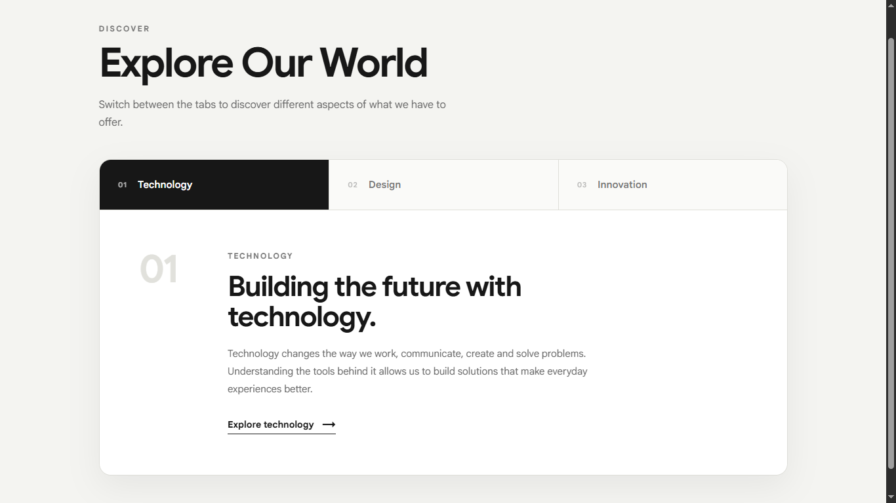
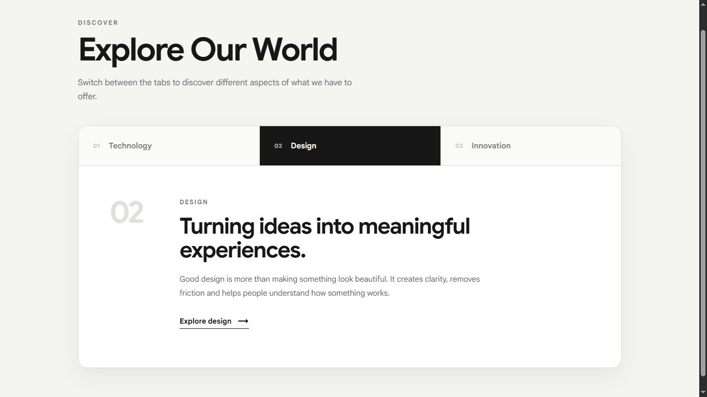
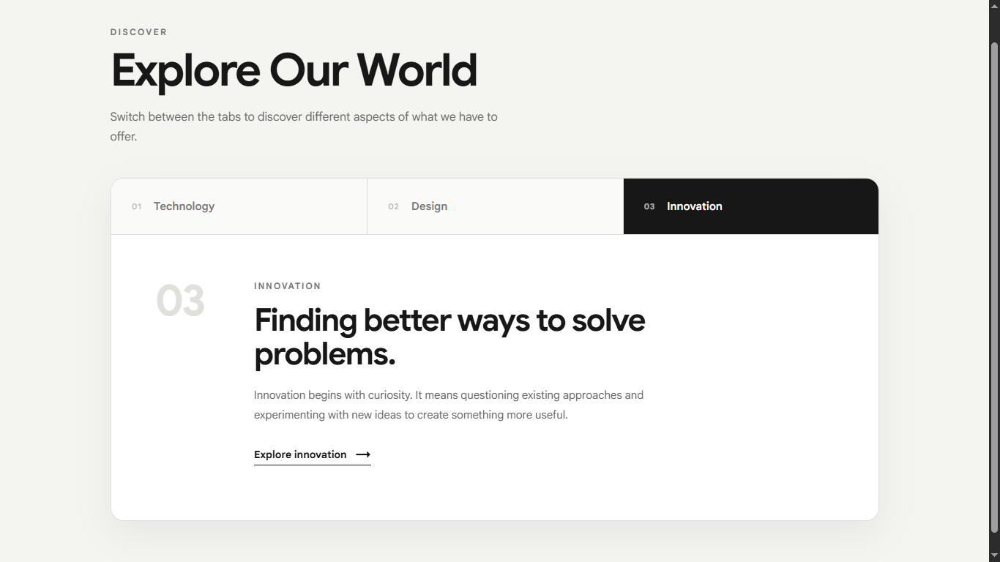

# Tabs Component

A polished, animated tabs component with smooth content transitions
and full ARIA support — built with vanilla JavaScript.

## Live Demo

[https://ifeanyi234.github.io/tabs/]

## Screenshots

**Tab 1 Active:**

**Tab 2 Active:**

**Tab 3 Active:**

## Features

- Three tabs each linked to a distinct content panel
- Active tab highlighted with clear visual distinction
- Content panels animate in with staggered slide transitions
- First tab active by default on load
- Fully responsive — stacks vertically on mobile
- ARIA attributes (aria-selected, role="tab") for accessibility

## Tech Stack

HTML, CSS, JavaScript (no frameworks)

## What I Learned

- Linking tabs to panels via data attributes instead of hardcoded logic
- Reset-everything-first pattern before applying new active state
- CSS animations triggered by adding/removing a class
- pointer-events: none on child spans to keep e.target reliable
- Clean event handler with no unnecessary conditionals

## Known Limitations

- No keyboard navigation between tabs (arrow keys)
- No URL hash support for shareable tab state

## What I'd Improve With More Time

- Add keyboard navigation matching ARIA tab pattern
- Animate tab indicator sliding between active tabs
- Support URL hash so a specific tab can be linked directly
